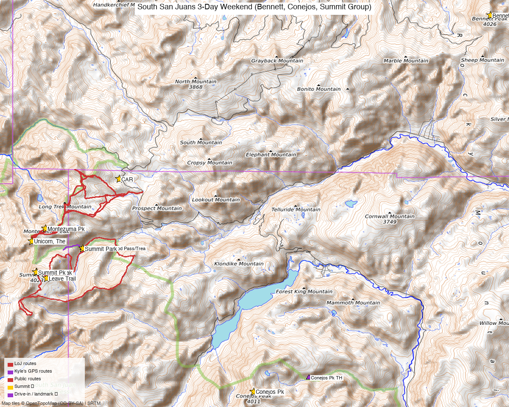

# South San Juans 3-Day Weekend — Bennett, Conejos & the Summit Peak Group

**Researched:** 2026-06-07
**Report type:** Multi-day trip (5 ranked 13ers over 3 climbing days, moving camp by vehicle each night)
**CalTopo research map:** https://caltopo.com/m/AS71AEC
**Status in DB:** All five 0 ascents (unclimbed). These are the far southeast San Juan 13ers — the South San Juan Wilderness high points plus Bennett on the Rio Grande side.

*[Interactive CalTopo map](https://caltopo.com/m/AS71AEC)* — the three areas are ~17 mi apart; the overview is a regional locator, per-area route detail is on the CalTopo map.

---

<!-- CLIMBERS_START -->
**Other climbers:** Emily Sharpe — not yet · Shawn D Keil — not yet
<!-- CLIMBERS_END -->

## Trip stats

| | |
|---|---|
| Days | 3 climbing days (drive down the evening before) |
| Peaks | 5 ranked 13ers — all unclimbed, all Class 1–2 |
| Total distance / gain | ~22–25 mi · ~9,000–10,000 ft across the three days |
| Style | **Car-camp, moving camp by vehicle each night** (not a backpack) |
| Drive from Boulder | **[5h 10m via Google Maps](https://www.google.com/maps/dir/?api=1&origin=1162+Peakview+Circle,+Boulder,+CO+80302&destination=37.460,-106.415)** to the Day-1 (Bennett) trailhead |
| One basecamp move | ~3 hr (Bennett/Del Norte side → Platoro side); the other hop is ~1.5 hr |

This is a **drive-and-day-hike** trip, not a backcountry basecamp: each peak/group is a separate Class 1–2 day from a car camp near its trailhead, with a vehicle relocation between days.

---

## Peaks covered

| Peak | Day | Elev | Class | Prom | From-camp stats | peak_db |
|---|---|---|---|---|---|---|
| Bennett Pk | 1 | 13,206' | 1 | 1,752' | ~5–9 mi / 2,400–3,400' (varies w/ 4WD start) | 607 |
| Summit Pk | 2 | 13,304' | 2 | 2,736' | trio: **10.2 mi / 4,449'** | 488 |
| Montezuma Pk | 2 | 13,158' | 2 | 688' | (same trio loop) | 654 |
| "The Unicorn" | 2 | 13,030' | 2 | 425' | (same trio loop) | 796 |
| Conejos Pk | 3 | 13,176' | 1 | 1,912' | **6.2 mi / ~2,500'** | 633 |

Summit, Montezuma, Unicorn, and Conejos sit in the **South San Juan Wilderness**; Bennett is just outside it on the Rio Grande side. Summit Peak (2,736' prom, 39.6 mi isolation) is the high point of the whole South San Juan range.

---

## Why a 3-day weekend works (grouping logic)

Grouped by **approach**, not summit proximity — the five fall into three trailheads:

- **The trio (Summit + Montezuma + Unicorn)** is a single Class 2 day — climbed *together* in every trip report (0.6–1.6 mi apart on a connecting ridge), from the **Elwood Pass / Treasure Creek** side.
- **Conejos** is its own short Class 1 day from the **Conejos River Rd (FS 250/105)** — only ~1.5 hr from the trio trailhead (same Platoro orbit).
- **Bennett** is the outlier — 15–17 mi NE, climbed from the **Del Norte / Rio Grande side (FS 265)**, a different drainage ~3 hr by road from the others.

So it's a clean **2-zone, 3-day** trip: do Bennett on the way in (it's the closest to Boulder), then relocate to the Platoro zone for the trio + Conejos.

---

## Day-by-day itinerary (moving camp each night)

### Eve — drive down
Boulder → **Bennett Pk TH** (FS 265, Del Norte side), **~5h 10m**. Car camp near the trailhead.

### Day 1 — Bennett Peak (13,206', Class 1)
- **Stats:** ~5–9 mi / 2,400–3,400' depending how far you drive the FS 265 / Cat Creek-area road (high-clearance helps; PB tracks range from a 4.7-mi high start to ~8.6 mi lower).
- **Route:** standard Class 1 tundra/ridge walk; a big standalone massif (1,752' prom). Often combined with sub-13k Pintada/Windy/Sheep/Silver (josephnephi did a 5-peak day, LoJ 24347) — skip those to keep it short.
- **Then:** drive **~3 hr** to the Platoro zone (Bennett TH → Trio TH is ~2h 49m / 57 mi via US-160). Car camp near Elwood Pass / Treasure Creek.

### Day 2 — Summit + Montezuma + Unicorn (the trio, Class 2)
- **Stats (measured, LoJ 24954):** **10.2 mi / 4,449'**, Class 2 — the day's biggest.
- **Route:** the standard one-day loop over all three (0.6–1.6 mi apart) from the **Elwood Pass / FS 380 → Treasure Creek (FR 243)** area. josephnephi (2023, LoJ 24954) and Furthermore (LoJ 1487) both did the trio in a push.
- **Then:** drive **~1h 28m / 28 mi** (FS 250 network) to the Conejos River Rd. Car camp near the Conejos TH.

### Day 3 — Conejos Peak (13,176', Class 1)
- **Stats (measured, LoJ 24956):** **6.2 mi / ~2,500'**, Class 1 — a short final day.
- **Route:** from **FS 250 → 105** (Conejos River; "all 2WD, last 5 mi rocky, mid-clearance recommended" — whileyh). Standard Class 1 walk-up.
- **Then:** drive home (~5 hr).

---

## Logistics — drives between camps

| Leg | Drive | Notes |
|---|---|---|
| Boulder → Bennett (Day 1) | ~5h 10m / 260 mi | via US-285 S |
| Bennett → Trio camp | ~2h 49m / 57 mi | via US-160 (the basecamp move) |
| Trio → Conejos camp | ~1h 28m / 28 mi | FS 250 dirt network, Platoro orbit |
| Conejos → home | ~5 hr | via US-285 N |

> Conejos ↔ Bennett directly is ~3h 19m / 109 mi (US-160 around) — which is why Bennett goes first/on-the-way-in rather than as a side trip from Platoro.

---

## Camps & water

- **Day-1 camp (Bennett):** dispersed sites along FS 265 / the Alamosa River–Del Norte access; water in the creeks. Outside designated wilderness — standard NF dispersed camping.
- **Day-2 camp (Trio):** dispersed sites near Elwood Pass / Treasure Creek (FS 380/243); high (~11,000'+), cold nights, water in Treasure Creek.
- **Day-3 camp (Conejos):** dispersed along the Conejos River Rd (FS 250); reliable river water.
- All three are **car-camp dispersed sites** — no permits, but the climbs enter the **South San Juan Wilderness** (Summit/Montezuma/Unicorn/Conejos), so follow wilderness rules on the hikes (no mechanized travel, Leave No Trace).

---

## Gear / conditions / season

- **Best window:** **mid-July through September** — the South San Juans hold snow late and the access roads (Elwood Pass, FS 250) open late. Afternoon monsoon storms are the dominant hazard on the exposed Class 2 trio ridge.
- **Gear:** standard Class 1–2 — no rope/axe/crampons in season. High-clearance/AWD useful on all three approach roads (FS 265, FS 380/243, FS 250→105); none strictly require hard 4WD to a reasonable start, but higher clearance shortens the days.
- **Weather strategy:** put the **trio (Day 2)** — the longest, most-exposed, Class 2 ridge day — on the most stable forecast day; Bennett and Conejos are shorter Class 1 and more storm-tolerant.

---

## Cell coverage

- No 14ers.com community reception data for these summits. Geographic reasoning: **all three trailheads/basins are likely dead** (deep SE San Juan / Conejos backcountry); summits may catch intermittent line-of-sight toward the San Luis Valley (Bennett/Conejos, facing E) but not reliably. **Carry an InReach** — this is remote country with long drives between zones.

---

## Trip reports & GPX (all three sources)

**Sources confirmed logged in:** 14ers.com ("Basin"), listsofjohn.com ("letsgocu"), peakbagger.com ("Kyle Knutson"). **36 GPX tracks** swept across the three sources and layered on the CalTopo map (colored by source).

### listsofjohn.com
| Date | Author | Peaks | TR |
|---|---|---|---|
| 2023-08-17 | josephnephi | **Summit + Montezuma + Unicorn** (the trio) | [24954](https://listsofjohn.com/tr?Id=24954) ⭐ |
| 2011-08-26 | Furthermore | Trio + Long Trek + Grayback + Bonito (big day) | [1487](https://listsofjohn.com/tr?Id=1487) |
| 2023-08-17 | josephnephi | Conejos (solo) | [24956](https://listsofjohn.com/tr?Id=24956) ⭐ |
| 2022-05-30 | whileyh | Conejos — road/approach beta (FS 250/105) | [22206](https://listsofjohn.com/tr?Id=22206) |
| 2023-05-12 | josephnephi | Bennett + Pintada + Windy + Sheep + Silver | [24347](https://listsofjohn.com/tr?Id=24347) ⭐ |
| 2023-07-28 | IntrepidXJ | Bennett + Long Trek ("from Elwood Pass") | [25058](https://listsofjohn.com/tr?Id=25058) |

### 14ers.com (logged in, "Basin")
Peak pages exist for all five; **no formal route descriptions** (route beta is TR-only). GPX-library tracks layered on the map.

### peakbagger.com (logged in, "Kyle Knutson")
Ascent GPX pulled for all five (Bennett pid 5880, Conejos 5883, Summit 5882, Unicorn 70845, Montezuma 16087) — 24 ascent tracks layered. PB isolation confirms the grouping (Unicorn 0.59 mi, Montezuma 1.56 mi, Conejos 8.1 mi, Bennett 17.1 mi).

**Sources checked:** 14ers.com ✓ (logged in, "Basin") · listsofjohn.com ✓ (logged in, "letsgocu") · peakbagger.com ✓ (logged in, "Kyle Knutson")

---

## TL;DR

- **Five unclimbed far-SE-San-Juan 13ers in a 3-day, 2-zone weekend**, all Class 1–2, moving car camp each night.
- **Day 1 — Bennett** (Class 1, ~5–9 mi) on the drive in (Del Norte/Rio Grande side, closest to Boulder at ~5h10m) → relocate ~3 hr to Platoro.
- **Day 2 — Summit + Montezuma + Unicorn** (the trio, **10.2 mi / 4,449', Class 2** — the big day) from Elwood Pass / Treasure Creek → 1.5-hr hop to Conejos.
- **Day 3 — Conejos** (Class 1, **6.2 mi / ~2,500'**) from the Conejos River Rd → drive home.
- **Drives between camps:** ~3 hr (Bennett→Platoro) and ~1.5 hr (Trio→Conejos); nothing worse than ~3 hr. The real cost is the ~5+ hr haul from Boulder each way.
- **Season:** mid-July–September; put the exposed trio day on the best forecast. Cell dead — carry an InReach.
- **Research map:** https://caltopo.com/m/AS71AEC (36 tracks, source-colored).
