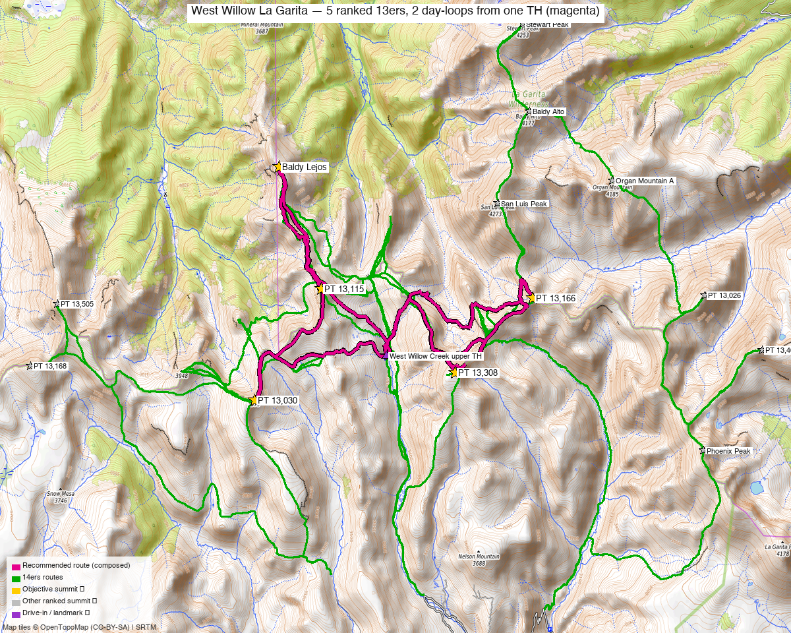

# West Willow Creek — 5 La Garita 13ers from San Luis Pass (2-Day)

<!-- QUICKSTATS_START -->

!!! tip "At a glance — 2-day trip"
    **Day 1 (Trio):** **11 mi** · **3,750 ft** gain · **Class 2** · 3 peaks
    **Day 2 (Bridge pair):** **8.2 mi** · **3,050 ft** gain · **Class 3** · 2 peaks
    **Total:** **19 mi** · **6,800 ft** gain · **Class 3** · 5 peaks · ~5 h drive

<!-- QUICKSTATS_END -->

**Researched:** 2026-06-10
**Report type:** Multi-day trip / backpack — 5 ranked 13ers over 2 days from one trailhead
**Status in DB:** all five unclimbed.

> Consolidates two day-reports that **launch from the same West Willow Creek upper TH** above Creede: the **[Baldy Lejos trio](../peaks/baldy_lejos_trio.md)** (Baldy Lejos + PT 13,115 + PT 13,030) and the **[PT 13,308 + PT 13,166 bridge pair](../peaks/pt_13308_13166.md)**. One trailhead, one camp — two day-loops (~11 and ~8 mi), or one big push. (The eastern [PT 13,408 + 13,026 pair](../peaks/pt_13026_13408.md) is *not* part of this — it's a separate Cochetopa/Eddiesville trailhead, a different drive.)

*Five ranked 13ers around one **West Willow Creek upper TH** (orange). The two **magenta day-loops** are the recommended routes — the trio to the NW, the bridge pair to the E/SE — each radiating from the same camp. Per-area route detail + interactive maps: [trio (4278RCG)](https://caltopo.com/m/4278RCG) · [bridge pair (9VGDUR3)](https://caltopo.com/m/9VGDUR3).*

---

<!-- CLIMBERS_START -->
**Other climbers:** Emily Sharpe — not yet · Shawn D Keil — not yet
<!-- CLIMBERS_END -->

## Trip stats

| | |
|---|---|
| Days | **2** (camp high near the upper TH / San Luis Pass) |
| Peaks | **5 ranked 13ers** — all unclimbed |
| Class | **2**, with one **Class 3** move on PT 13,166 |
| **Day — trio** | Baldy Lejos + PT 13,115 + PT 13,030 — **~11 mi / ~3,750'** (DEM) |
| **Day — bridge pair** | PT 13,308 + PT 13,166 — **~8.2 mi / ~3,050'** (DEM) |
| **2-day total** | **~19 mi / ~6,800'** |
| **Big-day option (all 5)** | **~18 mi / ~6,000'** — one efficient loop, but a huge day (see below) |
| Trailhead | **West Willow Creek upper TH (~11,500', 4WD — road status not guaranteed)** |
| Drive from Boulder | **~5 h to Creede**, then the rough West Willow Creek 4WD road |
| Land | **La Garita Wilderness** (Rio Grande / GMUG NF) — no permits/fees, foot-only beyond the TH, **dispersed/backpack camping allowed** |

All distances/gains are **DEM-measured from real recorded GPX** (`build_recommended_route.py`), not estimates.

---

## Why 2 days from one camp

All five share the **West Willow Creek upper TH** (~11,500', up the rough road from Creede). They fall into **two natural loops that meet along the high divide**:

- **The trio** (Baldy Lejos, PT 13,115, PT 13,030) sits **NW** of the TH — a ~11 mi Class 2 tundra loop.
- **The bridge pair** (PT 13,308, PT 13,166) sits **E/SE** of the TH — an ~8.2 mi loop with a **Class 3** move on PT 13,166.

Camp high near the upper TH (or up toward San Luis Pass) and do **one loop each day**. Order is flexible — **save PT 13,166's Class 3 for the more stable-weather day.**

> **Doing all five in one push is ~18 mi / ~6,000'** — actually a touch *shorter* than the two days combined, because a single graph-routed loop links them along the divide without two separate trailhead returns. But that's still **~18 mi and ~6,000' with a Class 3 move, at 12–13k', deep in the La Garita** — a genuine ultra-day. The **2-day split (camp high, one loop each day) is the sane recommendation**; it also lets you save PT 13,166's Class 3 for the better-weather day.

---

## Day plan

### Trio day — Baldy Lejos + PT 13,115 + PT 13,030 · ~11 mi / ~3,750' · Class 2
A rolling tundra loop NW of camp: up onto the divide, north to **Baldy Lejos (13,118')**, back south over **PT 13,115**, then **PT 13,030**, and down. Benign Class 2 — the day is length + altitude, not difficulty. **Full route, trip reports, and GPX: [Baldy Lejos trio report](../peaks/baldy_lejos_trio.md).**

### Bridge-pair day — PT 13,308 + PT 13,166 · ~8.2 mi / ~3,050' · Class 2 (Class 3 on 13,166)
E/SE of camp: a loop tagging **PT 13,308** and **PT 13,166**, the latter carrying a **Class 3** move — do it in good weather and dry rock. More gain than the trio for similar mileage. **Full route, trip reports, and GPX: [PT 13,308 + 13,166 report](../peaks/pt_13308_13166.md).**

---

## Drive + approach (shared)

| | |
|---|---|
| **Drive from Boulder** | **[~5 h to Creede via Google Maps](https://www.google.com/maps/dir/?api=1&origin=1162+Peakview+Circle,+Boulder,+CO+80302&destination=37.84913,-106.92766)**, then up Willow Creek. |
| Access | From Creede, up **Willow Creek Rd (FR 503)**; ¾ mi above town bear onto **West Willow Creek Rd** and climb toward San Luis Pass. 2WD ends near the **Equity Mine (~6.7 mi up)**; the 4WD continuation to the ~11,500' upper TH has been **FS-gated in recent years — confirm it's open**, or expect to walk (and add miles) from lower. |
| Trailhead | **West Willow Creek upper TH**, ~37.955, −106.967, **~11,500'**. |

> **You do not drive to San Luis Pass** — that's a hiking destination; the TH is named for the trail that starts there.

---

## Camp

- **La Garita Wilderness** — dispersed/backpack camping allowed beyond the TH (foot travel only). Camp near the **upper TH** or up toward **San Luis Pass** to sit central between the two loops.
- High and exposed; water from the upper West Willow / basin creeks (treat).

---

## Conditions / season

- **Best window:** **July–September.** High, remote La Garita; the West Willow road and upper basins open late.
- **Terrain:** rolling alpine tundra Class 2; **one Class 3 move on PT 13,166** — wants dry rock.
- **Storms:** wide-open tundra, no fast escape — start early both days, watch the sky.

---

## Cell coverage

- **Dead.** Deep in the La Garita; no reception at the TH or on the peaks. Carry an **InReach / satellite messenger**.

---

## TL;DR

- **Five ranked La Garita 13ers from one West Willow upper TH**, best as a **2-day backpack** (~19 mi / ~6,800'): a Class 2 trio day NW + a Class 2/3 pair day E/SE, camping high near San Luis Pass.
- **All five in a day is ~18 mi / ~6,000'** (one efficient graph-routed loop) — slightly shorter than two days, but a huge single day with a Class 3 move; strong parties only.
- **Crux is the road** (4WD to ~11,500', sometimes gated) and **PT 13,166's Class 3**, not the tundra.
- Detail + GPX: **[trio](../peaks/baldy_lejos_trio.md)** · **[bridge pair](../peaks/pt_13308_13166.md)**. Eastern [13,408 + 13,026 pair](../peaks/pt_13026_13408.md) is a *separate* Cochetopa trip.

**Sources checked:** 14ers.com ✓ (logged in, "letsgocu") · listsofjohn.com ✓ (logged in) · peakbagger.com ✓ (logged in) · climb13ers.com ✓ — synthesized from the two underlying day-reports.
